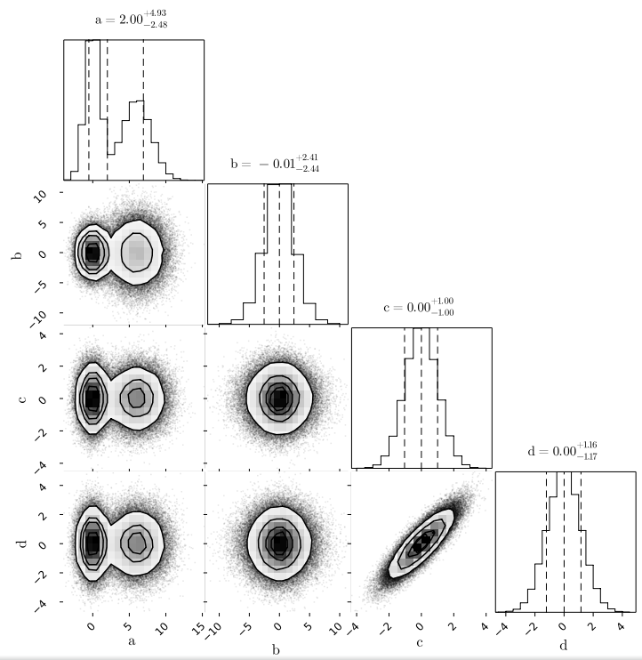
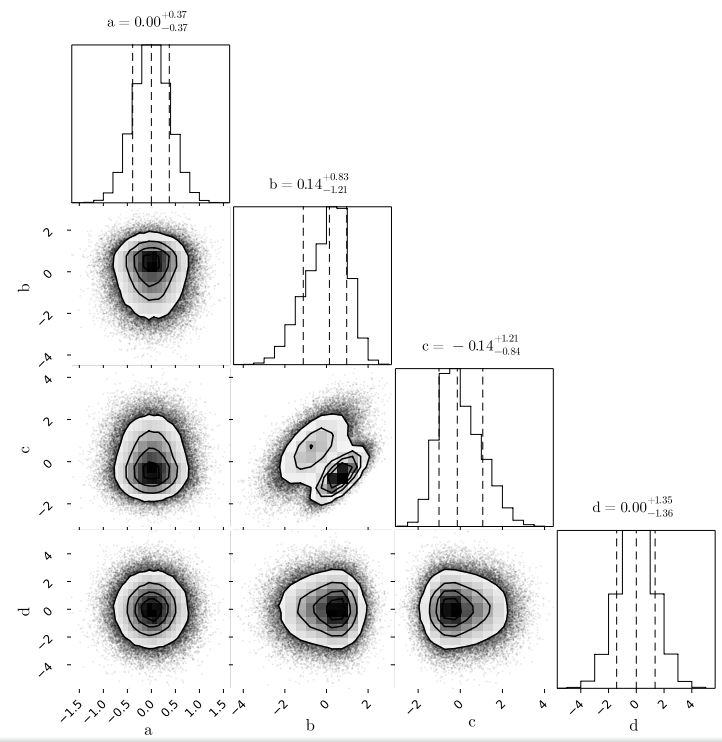
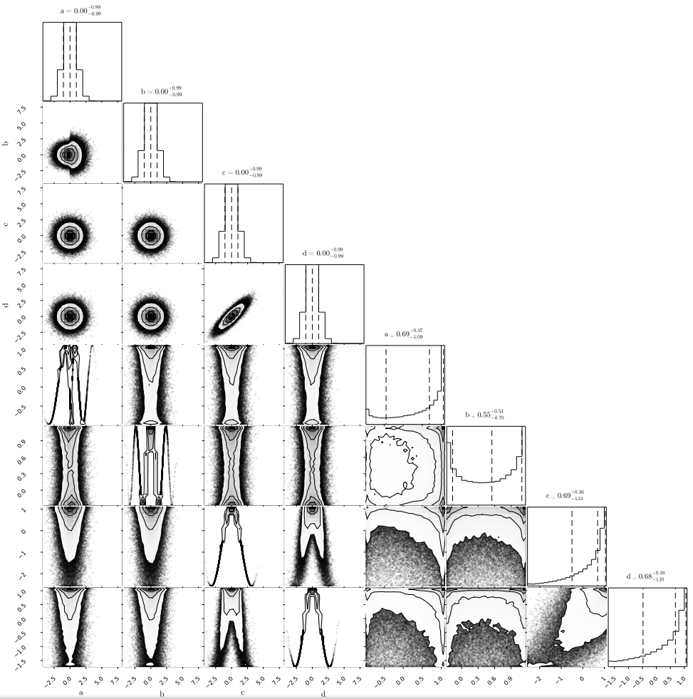

<p align="center">
  <br>
  <a href="https://github.com/JuliaML/TableTransforms.jl/actions">
    
  </a>
  <a href="https://codecov.io/gh/JuliaML/TableTransforms.jl">
    
  </a>
  <a href="LICENSE">
    
  </a>
</p>

This package provides transforms that are commonly used in statistics
and machine learning. It was developed to address specific needs in
feature engineering and works with general
[Tables.jl](https://github.com/JuliaData/Tables.jl) tables.

Past attempts to model transforms in Julia such as
[FeatureTransforms.jl](https://github.com/invenia/FeatureTransforms.jl)
served as inspiration for this package. We are happy to absorb any
missing transform, and contributions are very welcome.

## Features

- Transforms are **revertible** meaning that one can apply a transform
  and undo the transformation without having to do all the manual work
  keeping constants around.

- Pipelines can be easily constructed with clean syntax
  `(f1 → f2 → f3) ⊔ (f4 → f5)`, and they are automatically
  revertible when the individual transforms are revertible.

- Branches of a pipeline and colwise transforms are run in parallel
  using multiple threads with the awesome
  [Transducers.jl](https://github.com/JuliaFolds/Transducers.jl)
  framework.

- Pipelines can be reapplied to unseen "test" data using the same cache
  (e.g. constants) fitted with "training" data. For example, a `ZScore`
  relies on "fitting" `μ` and `σ` once at training time.

## Rationale

A common task in statistics and machine learning consists of transforming
the variables of a problem to achieve better convergence or to apply methods
that rely on multivariate Gaussian distributions. This process can be quite
tedious to implement by hand and very error-prone. We provide a consistent
and clean API to combine statistical transforms into pipelines.

*Although most transforms discussed here come from the statistical domain,
our long term vision is more ambitious. We aim to provide a complete
user experience with fully-featured pipelines that include standardization
of column names, imputation of missing data, and more.*

## Installation

Get the latest stable release with Julia's package manager:

```julia
] add TableTransforms
```

## Usage

Below is a quick example with simple transforms:

```julia
using TableTransforms
using PairPlots

# example table from PairPlots.jl
N = 100_000
a = [2randn(N÷2) .+ 6; randn(N÷2)]
b = [3randn(N÷2); 2randn(N÷2)]
c = randn(N)
d = c .+ 0.6randn(N)
table = (;a, b, c, d)

# corner plot of original table
table |> corner
```


```julia
# convert to PCA scores
table |> PCA() |> corner
```


```julia
# convert to any Distributions.jl
table |> Quantile(Normal()) |> corner
```


Below is a more sophisticated example with a pipeline that has
two parallel branches. The tables produced by these two branches
are concatenated horizontally in the final table:
```julia
# create a transform pipeline
f1 = ZScore()
f2 = Scale()
f3 = Quantile()
f4 = Functional(cos)
f5 = Interquartile()
pipeline = (f1 → f2 → f3) ⊔ (f4 → f5)

# feed data into the pipeline
table |> pipeline |> corner
```


To revert a pipeline or single transform, use the `apply` and `revert`
functions instead:

```julia
# apply transform and save cache to revert later
newtable, cache = apply(pipeline, table)

# perform additional modeling with newtable
# newtable = ...

# revert pipeline when done with modeling
original = revert(pipeline, newtable, cache)
```

Finally, it is sometimes useful to `reapply` a transform that was
"fitted" with training data to unseen test data. In this case, the
cache from a previous `apply` call is used:

```julia
# ZScore transform "fits" μ and σ using training data
newtable, cache = apply(ZScore(), traintable)

# we can reuse the same values of μ and σ with test data
newtable = reapply(ZScore(), testtable, cache)
```

## Available transforms

Please check the docstrings for additional information.

### Builtin

| Transform | Description |
|-----------|-------------|
| `Select` | Column selection |
| `Reject` | Column rejection  |
| `Identity` | Identity transform |
| `Center` | Mean removal |
| `Scale` | Interval scaling |
| `MinMax` | Shortcut for `Scale(low=0.0, high=1.0)` |
| `Interquartile` | Shortcut for `Scale(low=0.25, high=0.75)` |
| `ZScore` | Z-score (a.k.a. normal score) |
| `Quantile` | Quantile-quantile transform |
| `Functional` | Colwise function application |
| `EigenAnalysis` | Eigenanalysis of covariance |
| `PCA` | Shortcut for `ZScore() → EigenAnalysis(:V)` |
| `DRS` | Shortcut for `ZScore() → EigenAnalysis(:VD)` |
| `SDS` | Shortcut for `ZScore() → EigenAnalysis(:VDV)` |
| `Sequential` | Transform created with `→` (\to in LaTeX) |
| `Parallel` | Transform created with `⊔` (\sqcup in LaTeX) |

### External

#### [CoDa.jl](https://github.com/JuliaEarth/CoDa.jl) provides:

| Transform | Description |
|-----------|-------------|
| `Closure` | Compositional closure |
| `Remainder` | Compositional remainder |
| `ALR` | Additive log-ratio |
| `CLR` | Centered log-ratio |
| `ILR` | Isometric log-ratio |

## Custom transforms

It is easy to integrate custom transforms into existing
pipelines. The new transform should be a subtype of
`Transform`, and should implement `apply`. If the new
transform `isrevertible`, then it should also implement
`revert`.

## Contributing

Contributions are very welcome. Please [open an issue](https://github.com/JuliaML/TableTransforms.jl/issues) if you have questions.

Below are a few transforms that you can contribute:

- [ ] Standardization of column names
- [ ] Imputation of missing entries
- [ ] ...any transform that is useful

## Related packages

- [FeatureTransforms.jl](https://github.com/invenia/FeatureTransforms.jl)
  has transforms, but they are not fully revertible. Some of their
  transforms such as `MeanStdScaling` are constructed for a specific
  table and cannot be inserted in the middle of a pipeline for example.
- [AutoMLPipeline.jl](https://github.com/IBM/AutoMLPipeline.jl) relies on
  the Python stack via [PyCall.jl](https://github.com/JuliaPy/PyCall.jl).
  They provide pipelines with Julia's pipe `|>` operator and follow a
  more "Pythonic" interface. They do not support general
  [Tables.jl](https://github.com/JuliaData/Tables.jl).
- [Impute.jl](https://github.com/invenia/Impute.jl),
  [Cleaner.jl](https://github.com/TheRoniOne/Cleaner.jl),
  [DataConvenience.jl](https://github.com/xiaodaigh/DataConvenience.jl)
  all have a small set of transforms related to fixing column names as
  well as other basic transforms that we plan to absorb in the long term.
- [DataFramesMeta.jl](https://github.com/jkrumbiegel/Chain.jl) is a package
  to manipulate [DataFrames.jl](https://github.com/JuliaData/DataFrames.jl)
  tables. It is not intended for statistical transforms such as `PCA`,
  `Quantile`, etc, which rely on complex interactions between the rows and
  columns of a table. The usage of macros in the package promotes one-shot
  scripts as opposed to general pipelines that can be passed around to
  different places in the program.
- [Query.jl](https://github.com/queryverse/Query.jl) is a package to query
  [IterableTables.jl](https://github.com/queryverse/IterableTables.jl).
  Similar to other alternatives above, the package is not intended for
  advanced statistical transforms.
- [MLJ.jl](https://github.com/alan-turing-institute/MLJ.jl) is one of the
  most popular packages for machine learning in Julia. They provide pipelines
  and other types of composite models using Julia macros in order to access
  internal fields of the transforms for hyperparameter tuning. The usage of
  macros can be daunting, specially for first-time users of the language.
  They are hard to implement and can silently break Julia code in specific
  environments (e.g. Pluto).
